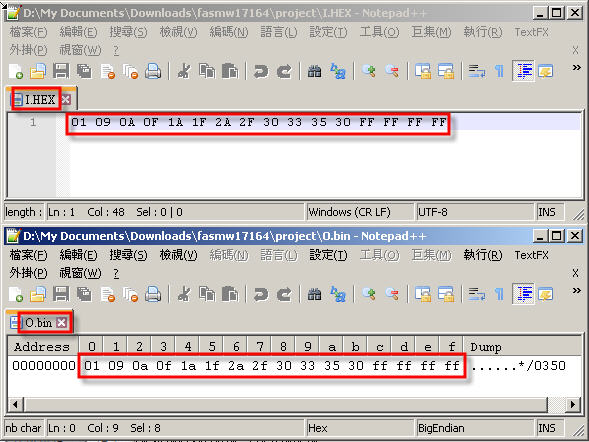

# hex2bin
Read ASCII encoded HEX file, filter out spaces, 0x0a and 0x0d then written output file in BIN mode, should works with XP to Win10

  
[hex2bin.asm](/hex2bin.asm) Intel x86 asm, Windows console program, source code, should be self explanatory   
[hex2bin_exe](/hex2bin_exe) Intel x86 asm, Windows console program ,download than rename to .exe or compile your own, file size about 2K  
[I.HEX](/I.HEX) source file for test and conversion, pure ascii file  
O.bin, target output BIN file, will be generates every time invoke this small program

The result,  

